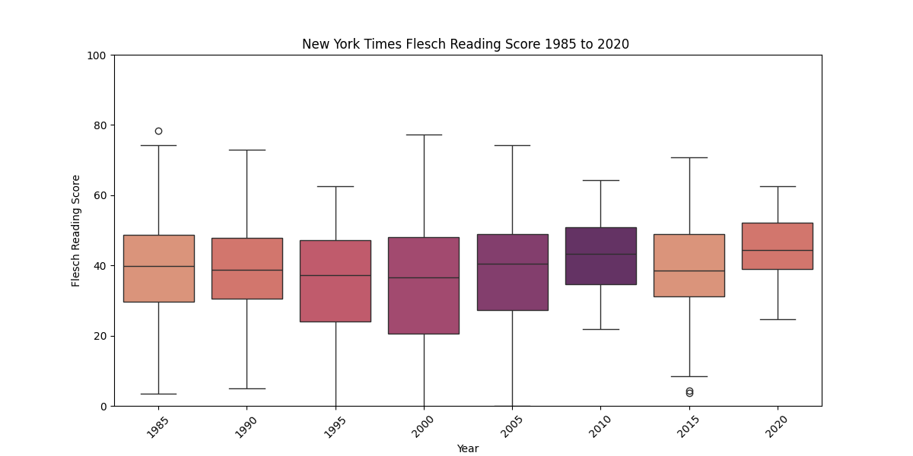

## News Article Lexical Analysis
See more at https://github.com/brandt-buchda/news-article-lexical-analysis 
```python
# From parsehtml.py
class ParseHtml:
    def query_date_range(self, start_date, end_date, n=10):
        self.params['begin_date'] = start_date
        self.params['end_date'] = end_date

        response = requests.get(self.newspaper['api'], params=self.params)

        data = response.json()
        hrefs = [doc['web_url'] for doc in data['response']['docs']]

        return hrefs

def parse_article_contents(href):
    request = requests.get(href)
    time.sleep(1)

    soup = BeautifulSoup(request.content, 'html.parser')
    text = soup.find_all('p')
    paragraphs = []

    for paragraph in text:
        paragraphs.append(paragraph.get_text())

    return Article(href, split_title(href), "", paragraphs)

# From serialize.py
class CsvSerialize:
    def serialize_article_data(self, article: Article):
        with open(self.get_article_path(article.title), "w", newline='', encoding='utf-8') as file:
            writer = csv.writer(file)

            writer.writerow(["href", "title", "author", "paragraphs"])
            writer.writerow([article.get_href(), 
                             article.get_title(), 
                             article.get_author()] + article.get_data())

            if article.get_metrics() is not None:
                for row in article.get_metrics():
                    writer.writerow(row.keys())
                    writer.writerow(row.values())
                    
# From analyzedata.py
import pandas
from readability import Readability
import lib.utility

def compute_flesh_reading_score(articles):
    result = pandas.DataFrame(columns=['year', 'flesch_score'])
    for article in articles:
        delimiter = " "
        try:
            raw_data = delimiter.join(article.get_data())
            flesch = Readability(raw_data).flesch()
        except:  # Readability may throw an exception if the data is too short
            continue
        year = int(lib.utility.split_date(article.get_href())[0:4])
        row = pandas.DataFrame([{'year': year, 'flesch_score': flesch.score}])
        result = pandas.concat([result, row], ignore_index=True)

    return result

# From fleschreadingscore.py
def main():
    csv_serialize = CsvSerialize(constants.Newspapers.NEW_YORK_TIMES, constants.Paths.CSV_DIRECTORY)

    articles = csv_serialize.load_all_article_data()
    filtered_articles = [a for a in articles if int(split_date(a.get_href())[0:4]) % 5 == 0]
    data = analyzedata.compute_flesh_reading_score(filtered_articles)

    palette = sns.color_palette(palette="flare")

    plt.figure(figsize=(12, 6))
    sns.boxplot(x='year', y='flesch_score', data=data, palette=palette, hue='year', legend=False)

    plt.title('New York Times Flesch Reading Score 1985 to 2020 ')
    plt.xlabel('Year')
    plt.ylabel('Flesch Reading Score')
    plt.xticks(rotation=45)
    plt.ylim(0, 100)
    plt.show()
```

