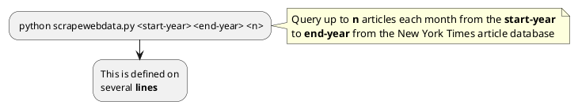

# News Article Lexical Analysis
This repository contains code 

## Data flow


```python 
class CsvSerialize:
    def get_article_path(self, title):
        return f'{self.directory}{self.newspaper}/{title}.{self.extension}'

    def serialize(self, article: Article):
        with open(self.get_article_path(article.title), "w", newline='') as file:
            writer = csv.writer(file)

            writer.writerow(["href", "title", "author", "paragraphs"])
            writer.writerow([article.get_href(), article.get_title(), article.get_author()] + article.get_data())

            for row in article.get_metrics():
                writer.writerow(row.keys())
                writer.writerow(row.values())

    def deserialize(self, title: str) -> Article:
        with open(self.get_article_path(title), "r", newline='') as file:
            reader = csv.reader(file)

            for row in reader[1:]:
                href = row[0]
                title = row[1]
                author = row[2]
                paragraphs = []
                for paragraph in row[3:]:
                    paragraphs.append(paragraph)

                return Article(href, title, author, paragraphs)
